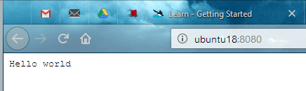
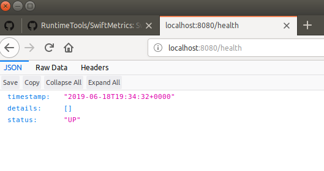
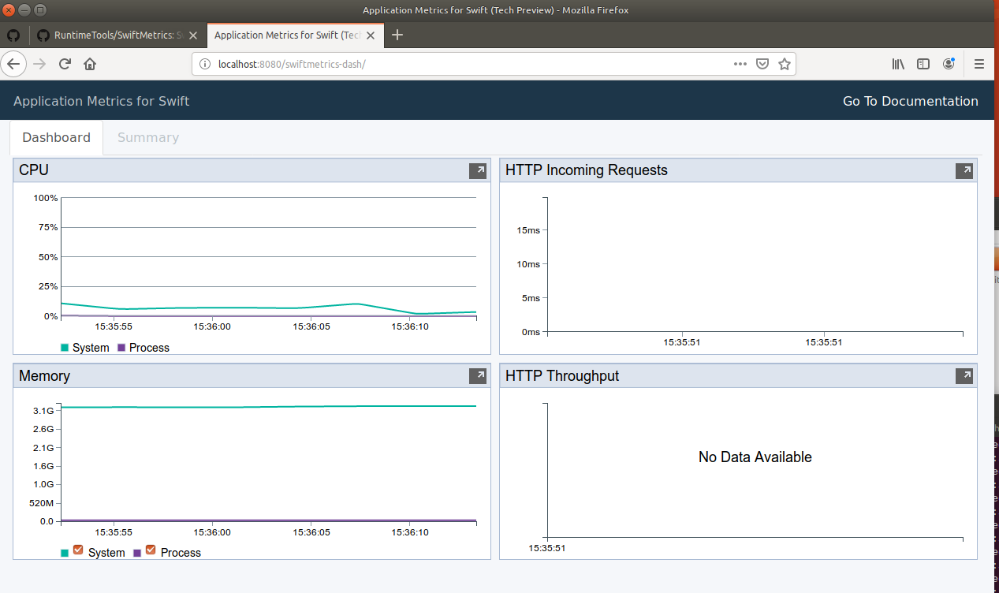

# RestKitura

A Simple REST server using Swift 5.0.1 on Ubuntu 18.04.

## Step 1: Steps to get started with Kitura:
0. Install swift 5.0.1 for ubuntu 18.04 and all required prerequisites. For more information, visit [www.kitura.io](http://www.kitura.io).
1. Generate an executable project using the commands: 
```bash
//bash
mkdir RestKitura
cd RestKitura
swift package init --type executable
```
2. Add Kitura and HeliumLogger dependencies for the application in Package.swift
3. Add Quick and Nimble dependencies for testing
4. Write a simple Hello World server to test all id working
5. Write a vanilla test to test the framework tests are working
6. Add VanillaTests module to Package.swift
7. Test that Quick and Nimble are working
```bash
//bash
swift test
```
The output:
```log
[3/3] Linking ./.build/x86_64-unknown-linux/debug/RestKituraPackageTests.xctest
Test Suite 'All tests' started at 2019-06-13 11:19:09.478
Test Suite 'debug.xctest' started at 2019-06-13 11:19:09.501
Test Suite 'QuickSpec' started at 2019-06-13 11:19:09.501
Test Case 'QuickSpec.Vanilla tests, Test that Quick and Nimble are setup, True is always true' started at 2019-06-13 11:19:09.501
Test Case 'QuickSpec.Vanilla tests, Test that Quick and Nimble are setup, True is always true' passed (0.001 seconds)
Test Case 'QuickSpec.Vanilla tests, Test that Quick and Nimble are setup, false is always false' started at 2019-06-13 11:19:09.502
Test Case 'QuickSpec.Vanilla tests, Test that Quick and Nimble are setup, false is always false' passed (0.0 seconds)
Test Case 'QuickSpec.Vanilla tests, Test that Quick and Nimble are setup, false is not true' started at 2019-06-13 11:19:09.502
Test Case 'QuickSpec.Vanilla tests, Test that Quick and Nimble are setup, false is not true' passed (0.0 seconds)
Test Case 'QuickSpec.Vanilla tests, Test that Quick and Nimble are setup, true is not false' started at 2019-06-13 11:19:09.502
Test Case 'QuickSpec.Vanilla tests, Test that Quick and Nimble are setup, true is not false' passed (0.0 seconds)
Test Suite 'QuickSpec' passed at 2019-06-13 11:19:09.502
         Executed 4 tests, with 0 failures (0 unexpected) in 0.001 (0.001) seconds
Test Suite 'debug.xctest' passed at 2019-06-13 11:19:09.502
         Executed 4 tests, with 0 failures (0 unexpected) in 0.001 (0.001) seconds
Test Suite 'All tests' passed at 2019-06-13 11:19:09.502
         Executed 4 tests, with 0 failures (0 unexpected) in 0.001 (0.001) seconds
```
8. start that the server by the commad:
```bash
//bash
swift run
```
The output:
```log
[2/2] Linking ./.build/x86_64-unknown-linux/debug/RestKitura
[2019-06-13T11:31:13.344-04:00] [VERBOSE] [Kitura.swift:160 run()] Starting Kitura framework...
[2019-06-13T11:31:13.354-04:00] [VERBOSE] [Kitura.swift:177 start()] Starting an HTTP Server on port 8080...
[2019-06-13T11:31:13.354-04:00] [INFO] [HTTPServer.swift:237 listen(_:)] Listening on port 8080
[2019-06-13T11:31:13.354-04:00] [VERBOSE] [HTTPServer.swift:238 listen(_:)] Options for port 8080: maxPendingConnections: 100, allowPortReuse: false
```
9. Test the server by navigating to [http://localhost:8080](http://localhost:8080) 
<p align="center">


or by using Curl in another terminal:
```bash
//bash
curl http://localhost:8080/
```
The output:
```log
Hello world
```
The server log for each request:
```log
[2019-06-13T11:35:18.420-04:00] [VERBOSE] [HTTPServerRequest.swift:333 parsingCompleted()] HTTP request from=192.168.56.102; proto=http;
[2019-06-13T11:35:18.597-04:00] [VERBOSE] [HTTPServerRequest.swift:333 parsingCompleted()] HTTP request from=192.168.56.102; proto=http;
[2019-06-13T11:40:36.725-04:00] [VERBOSE] [HTTPServerRequest.swift:333 parsingCompleted()] HTTP request from=127.0.0.1; proto=http;
```

## Step 2: Application refactoring
- Add a new module Application with all the logic and that can be easily tested.
- RestKitura depends only on Application
- Add /health route
<p align="center">


- Add a monitoring dashboard at /swiftmetrics-dash
<p align="center">


## TODO
- Add models
- Add CRUD routes
- Add models persitence
